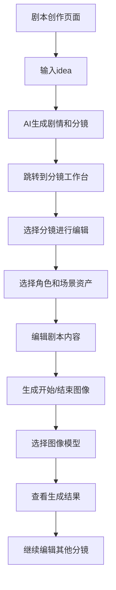

## 1. 产品概述
AI动漫生成平台专注于图生图创作，提供完整的分镜创作流程。用户从创意idea开始，通过AI辅助生成剧本并自动划分分镜，然后在分镜工作台中对每个分镜进行精细化创作和图像生成。

## 2. 核心功能

### 2.1 用户角色
| 角色 | 注册方式 | 核心权限 |
|------|----------|----------|
| 创作者 | 邮箱注册 | 剧本创作、分镜编辑、图像生成、资产管理 |

### 2.2 功能模块
主要页面包括：
1. **剧本创作页面**：用户输入idea，AI生成60秒剧情并自动划分分镜
2. **分镜工作台页面**：分镜列表、资产选择、图像生成、模型配置
3. **资产库页面**：角色和场景资产的创建、编辑、管理

### 2.3 页面详情
| 页面名称 | 模块名称 | 功能描述 |
|----------|----------|----------|
| 剧本创作页面 | Idea输入区 | 输入创作idea，支持多行文本输入 |
| 剧本创作页面 | AI生成按钮 | 调用AI分析剧本，生成60秒剧情和分镜 |
| 剧本创作页面 | 生成结果预览 | 显示AI生成的剧情文本和分镜列表 |
| 分镜工作台页面 | 分镜列表 | 显示所有分镜，支持拖拽排序和删除 |
| 分镜工作台页面 | 资产选择器 | 选择角色和场景资产，支持多选角色 |
| 分镜工作台页面 | 剧本编辑区 | 编辑分镜剧本内容和动作描述 |
| 分镜工作台页面 | 图像生成区 | 生成开始和结束图像，支持图生图模式 |
| 分镜工作台页面 | 模型选择器 | 选择AI模型（仅显示图生图模型） |
| 资产库页面 | 资产列表 | 显示所有角色和场景资产 |
| 资产库页面 | 资产创建 | 创建新资产，上传图片和填写信息 |
| 资产库页面 | 资产编辑 | 编辑现有资产信息和替换图片 |

## 3. 核心流程

## 4. 用户界面设计

### 4.1 设计风格
- **主色调**：深色系背景（#0a0a0a）搭配霓虹蓝色 accent
- **按钮样式**：圆角矩形，hover效果带有发光边框
- **字体**：Inter字体，正文14px，标题16-20px
- **布局风格**：卡片式布局，左右分栏设计
- **图标风格**：使用Lucide React图标库，线条简洁风格

### 4.2 页面设计概述
| 页面名称 | 模块名称 | UI元素 |
|----------|----------|--------|
| 剧本创作页面 | 主输入区 | 深灰色卡片背景，大字体文本域，最小高度300px |
| 剧本创作页面 | 生成按钮 | 蓝色渐变背景，包含魔法棒图标和箭头 |
| 分镜工作台页面 | 分镜卡片 | 白色边框，包含序号、左右分栏布局 |
| 分镜工作台页面 | 资产选择 | 下拉菜单形式，选中后显示资产缩略图 |
| 分镜工作台页面 | 图像生成 | 并排显示开始和结束图像的轮播组件 |
| 分镜工作台页面 | 模型选择 | 标签式选择器，仅显示图生图模型 |

### 4.3 响应式设计
- 桌面优先设计，最小宽度1280px
- 移动端适配：分镜卡片垂直堆叠，资产选择改为底部抽屉
- 触摸优化：增大点击区域，支持滑动操作

### 4.4 技术规格
- **图生图模型**：Fal.ai的FLUX.1 dev和Fast SDXL
- **资产格式**：支持PNG、JPG、WEBP图片格式
- **图像尺寸**：16:9横屏比例，默认1920x1080
- **文件大小**：单张图片不超过10MB