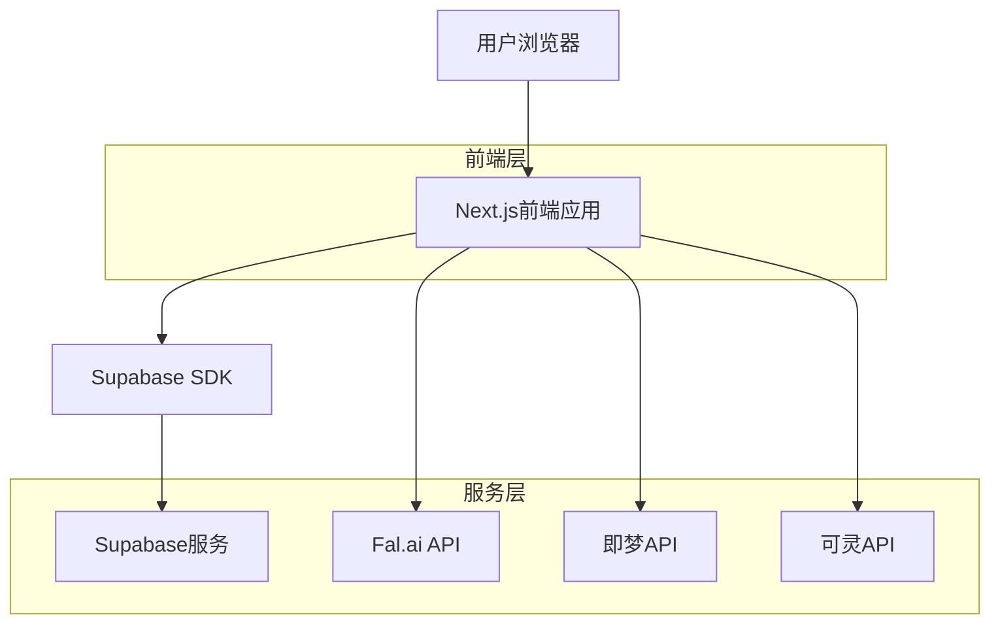
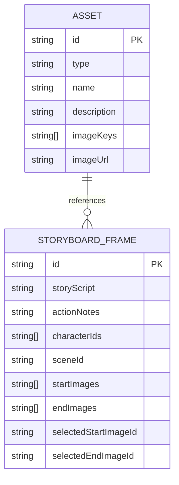

## 1. 架构设计



## 2. 技术栈描述
- **前端**: Next.js 14 + React 18 + TypeScript + Tailwind CSS
- **初始化工具**: create-next-app
- **后端**: Supabase (认证 + PostgreSQL数据库 + 文件存储)
- **AI服务**: Fal.ai (FLUX.1 dev, Fast SDXL), 即梦, 可灵
- **状态管理**: Zustand
- **UI组件**: Shadcn/UI + Radix UI
- **图标**: Lucide React

## 3. 路由定义
| 路由 | 用途 |
|-------|---------|
| / | 分镜工作台主页面 |
| /script | 剧本创作页面 |
| /api/analyze-script | AI剧本分析接口 |
| /api/generate | 图像生成接口 |
| /api/assets | 资产管理接口 |
| /api/health | API健康检查接口 |

## 4. API定义

### 4.1 剧本分析API
```
POST /api/analyze-script
```

请求:
| 参数名 | 参数类型 | 是否必需 | 描述 |
|-----------|-------------|-------------|-------------|
| script | string | true | 用户输入的idea或剧本 |

响应:
| 参数名 | 参数类型 | 描述 |
|-----------|-------------|-------------|
| frames | array | 分镜列表，包含剧本和动作描述 |
| story | string | 生成的完整剧情文本 |

示例:
```json
{
  "script": "一个赛博朋克侦探在霓虹街道上行走"
}
```

### 4.2 图像生成API
```
POST /api/generate
```

请求:
| 参数名 | 参数类型 | 是否必需 | 描述 |
|-----------|-------------|-------------|-------------|
| prompt | string | true | 图像生成提示词 |
| modelId | string | true | 模型ID (fal-flux-dev, fal-fast-sdxl) |
| imageUrl | string | false | 图生图参考图片URL |
| aspect_ratio | string | false | 宽高比，默认16:9 |

响应:
| 参数名 | 参数类型 | 描述 |
|-----------|-------------|-------------|
| request_id | string | 请求ID |
| endpoint | string | 轮询端点 |
| modelId | string | 使用的模型ID |

## 5. 数据模型

### 5.1 实体关系图


### 5.2 数据表定义

**资产表 (assets)**
```sql
CREATE TABLE assets (
    id UUID PRIMARY KEY DEFAULT gen_random_uuid(),
    type VARCHAR(20) NOT NULL CHECK (type IN ('character', 'scene')),
    name VARCHAR(100) NOT NULL,
    description TEXT,
    image_keys TEXT[], -- Supabase存储的文件key数组
    image_url TEXT, -- 主图片URL
    created_at TIMESTAMP WITH TIME ZONE DEFAULT NOW(),
    updated_at TIMESTAMP WITH TIME ZONE DEFAULT NOW()
);

-- 创建索引
CREATE INDEX idx_assets_type ON assets(type);
CREATE INDEX idx_assets_created_at ON assets(created_at DESC);
```

**分镜表 (storyboard_frames)**
```sql
CREATE TABLE storyboard_frames (
    id UUID PRIMARY KEY DEFAULT gen_random_uuid(),
    story_script TEXT NOT NULL,
    action_notes TEXT,
    character_ids TEXT[], -- 关联的资产ID数组
    scene_id TEXT, -- 关联的场景资产ID
    start_images JSONB, -- 生成的开始图像数组
    end_images JSONB, -- 生成的结束图像数组
    selected_start_image_id TEXT,
    selected_end_image_id TEXT,
    created_at TIMESTAMP WITH TIME ZONE DEFAULT NOW(),
    updated_at TIMESTAMP WITH TIME ZONE DEFAULT NOW()
);

-- 创建索引
CREATE INDEX idx_frames_created_at ON storyboard_frames(created_at DESC);
```

## 6. AI模型配置

### 6.1 Fal.ai图生图模型
- **fal-flux-dev**: FLUX.1 dev模型，支持图生图
- **fal-fast-sdxl**: Fast SDXL模型，支持图生图

### 6.2 模型特性
- 支持IP-Adapter和LoRA（需要用户提供相应文件）
- 支持参考图像输入进行图生图生成
- 默认生成16:9比例的图像
- 支持inpainting编辑功能

## 7. 部署配置

### 7.1 环境变量
```bash
# Supabase
NEXT_PUBLIC_SUPABASE_URL=
NEXT_PUBLIC_SUPABASE_ANON_KEY=
SUPABASE_SERVICE_ROLE_KEY=

# AI服务API密钥
FAL_KEY=
KLING_ACCESS_KEY=
JIMENG_AK=
JIMENG_SK=

# 可选配置
NEXT_PUBLIC_API_DEBUG=true
```

### 7.2 Supabase策略
```sql
-- 资产表访问权限
GRANT SELECT ON assets TO anon;
GRANT ALL PRIVILEGES ON assets TO authenticated;

-- 分镜表访问权限
GRANT SELECT ON storyboard_frames TO anon;
GRANT ALL PRIVILEGES ON storyboard_frames TO authenticated;
```